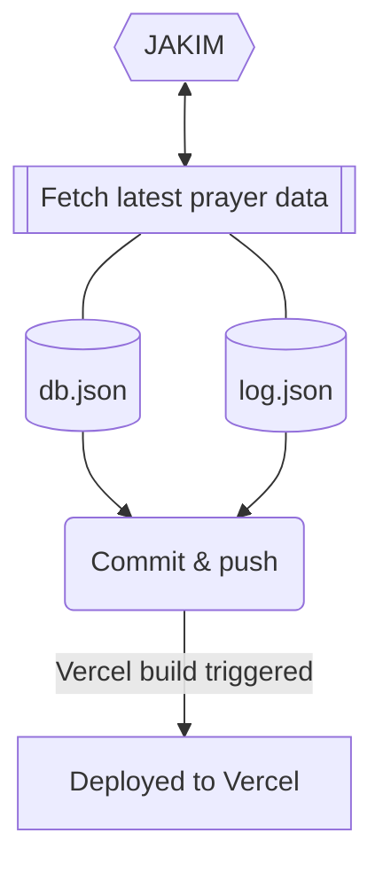

> [!WARNING]
> # Deprecation notice
> This API server codebase is deprecated. Please visit latest implementation:
> - Prayer Time API: https://github.com/mptwaktusolat/api-waktusolat-x
> 
> Internal usage:
> - Images Media Endpoint: https://github.com/mptwaktusolat/api-islamic-media
> - Feedback Endpoint: https://github.com/iqfareez/maklum

____


# Waktu Solat API | Malaysia Prayer Time API

> Formally 'MPT Server'

A Malaysia Prayer Time REST API server, originally build for [Malaysia Prayer Time](https://github.com/mptwaktusolat/app_waktu_solat_malaysia) app. Provide necessary data and procssing for the app features to work.

## Getting Started

### Prepare environment

> [!NOTE]
> If you didn't plan to use` /api/jadual_solat` endpoint, you may skip this step and proceed to [Start development server](#start-development-server)

Create `.env.local` at the root the project. Example environment vars are in the `.env.example` file. Or run:

```
cp .env.example .env.local
```

`/api/jadual_solat` will generate PDF based on the prayer data. To do so, it need to access Chrome. In development, you can use your local Chrome, but on Production, you need to setup the Chrome instance somewhere. I use https://www.browserless.io/ service.

Grab the API key and paste to `BROWSERLESS_TOKEN` key.

### Start development server


First, install the dependencies:

```bash
yarn install
```

Run the development server:

```bash
yarn dev
```

Open [http://localhost:3000](http://localhost:3000) with your browser to see the result.

### Mirror the live dataset locally

To pull the live JSON dataset from `api.waktusolat.app` into a local file:

```bash
yarn sync:live-data --start-year 2023 --end-year 2027 --output json/full-dump.json
```

The script fetches `/zones` and then downloads `/v2/solat/{zone}?year=YYYY&month=M` for every zone/month in the requested range.

For a smaller probe, limit the month range:

```bash
yarn sync:live-data --start-year 2026 --end-year 2026 --start-month 3 --end-month 3 --output json/march-2026.json
```

### Store the mirrored data in Supabase

1. Run the SQL in [supabase/schema.sql](/Users/rizhanruslan/Developer/api-waktusolat/supabase/schema.sql) inside the Supabase SQL editor.
2. Set `NEXT_PUBLIC_SUPABASE_URL` and `SUPABASE_SERVICE_ROLE_KEY` in `.env` or `.env.local`.
3. Import the mirrored dump:

```bash
yarn import:supabase --input json/full-dump.json
```

When those env vars are present, the `v2/solat` API routes will read from Supabase first and fall back to Firebase only if Supabase is not configured.

### Donation pool backend

Apply the latest SQL in [supabase/schema.sql](/Users/rizhanruslan/Developer/api-waktusolat/supabase/schema.sql) to create:

- `donation_pool_monthly` for the public month aggregate
- `donation_events` for idempotent event logging
- `support_toast_schedule` for app-controlled support toast timing and copy

Set `DONATION_POOL_API_KEY` for trusted backend writes. The new route is:

```text
GET  /api/donations/pool/current?month=2026-03
POST /api/donations/pool/current
GET  /api/support/toasts/schedule
POST /api/support/toasts/schedule
```

`GET` is public and returns the current month total, target, cap, and progress.

`POST` requires the `x-donation-admin-key` header and supports:

- `action: "record"` to insert a donation event and increment the month total once
- `action: "set_target"` to let your worker adjust the visible target as the pool grows

`/api/support/toasts/schedule` lets the app fetch the live toast schedule and lets your backend update:

- message copy
- enabled or disabled state
- launch count trigger
- streak trigger
- minimum hours between shows
- priority
- progress-bar usage
- auto-dismiss seconds

### Indonesia prayer data

Indonesia prayer data uses a separate ingestion flow and separate API routes.

Pull Indonesia monthly prayer schedules into a local JSON file:

```bash
yarn sync:indonesia-data --year 2026 --output json/indonesia-prayer-data.json
```

Import the generated file into Supabase after applying the latest SQL in [supabase/schema.sql](/Users/rizhanruslan/Developer/api-waktusolat/supabase/schema.sql) or the Indonesia-only SQL in [supabase/indonesia-schema.sql](/Users/rizhanruslan/Developer/api-waktusolat/supabase/indonesia-schema.sql):

```bash
yarn import:indonesia-supabase --input json/indonesia-prayer-data.json
```

Available API routes after import:

```text
/api/indonesia/regions
/api/indonesia/regions/match?city=Bandung&province=Jawa%20Barat
/api/indonesia/regions/resolve-gps?lat=-6.2088&long=106.8456
/api/indonesia/v1/solat/{regionId}?year=2026&month=3
```

The `pages/api` directory is mapped to `/api/*`. Files in this directory are treated as [API routes](https://nextjs.org/docs/api-routes/introduction) instead of React pages.

## (Optional) Make your own Firestore database instance

`/api/v2/solat` endpoint will fetch the prayer data from Firestore datatabase. To prepare the data needed, see https://github.com/mptwaktusolat/waktusolat-fetcher.


Once setup, set `FIREBASE_API_KEY` to your own Firebase API key.


## How are the prayer time data is updated every month? (Old method)

> [!NOTE]
> This method is used to update the `/solat` endpoint. Now that the endpoint is deprecated, I'll stop the automatic workflow soon. For latest method on fetching the prayer time, see [waktusolat-fetcher](https://github.com/mptwaktusolat/waktusolat-fetcher)


The data is updated automatically every month using GitHub Action. The overall flow is depicted in the diagram below.



View the fetcher implementation [here](./fetcher).

### Deployment status

[](https://github.com/mptwaktusolat/mpt-server/actions/workflows/vercel-prod.yml)
[](https://github.com/mptwaktusolat/mpt-server/actions/workflows/vercel-preview.yml)

### API endpoints

#### Public usage

See https://mpt-server.vercel.app/docs

#### Internal usage (MPT App)
* **`POST`** `/api/feedback`
